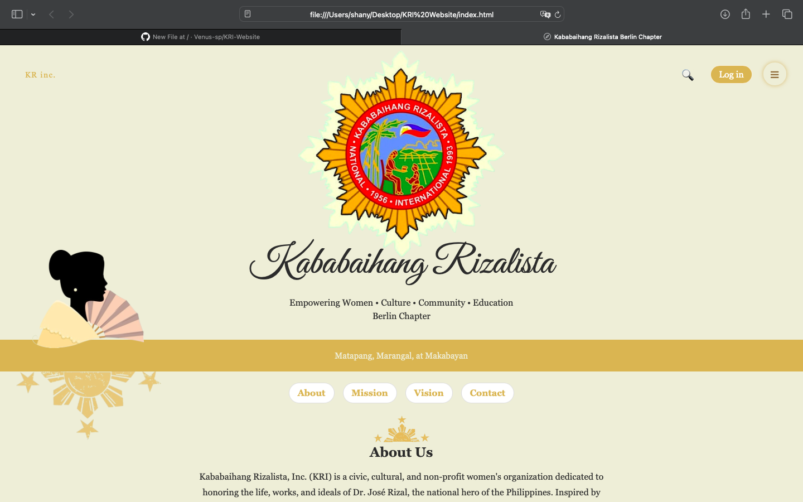

# Kababaihang Rizalista Website

This is a front-end prototype website for the Kababaihang Rizalista Berlin Chapter.  
The organization is planned to be officially established in June 2026. This project represents its conceptual online presence.

## Live Demo
https://venus-sp.github.io/KRI-Website/

## Role
Personal Front-End Project (Beginner)

## Features
- Navigation menu
- Projects page
- Activities page
- Interactive UI elements

## Technologies Used
- HTML
- CSS
- JavaScript

## Project Structure

- index.html (Homepage)
- activities.html (Activities page)
- projects.html (Projects page)
- style.css (Styling)
- script.js (Interactivity)
- images/ (Assets)

## Future Improvements
- Login system  
- Search functionality  
- Social media integration  
- Database for members & events  

## Current Status
Prototype project. Login system and search functionality are planned but not yet implemented.

## Preview  

## License
© 2026 Kababaihang Rizalista Berlin Chapter.  
Source code is licensed under the MIT License. All brand content is protected and not for reuse without permission.
